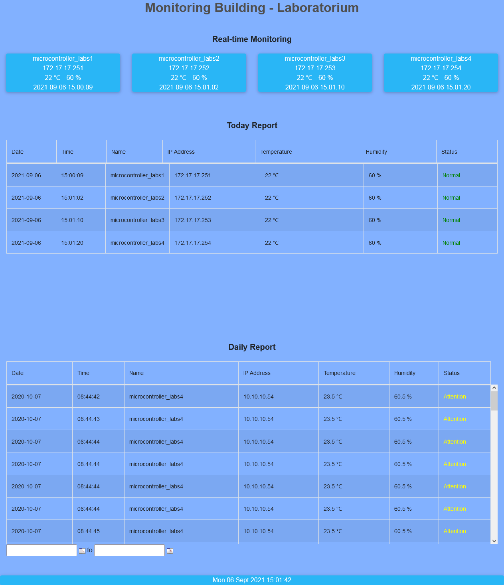
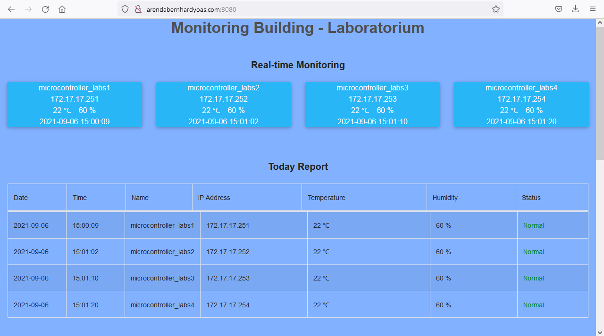
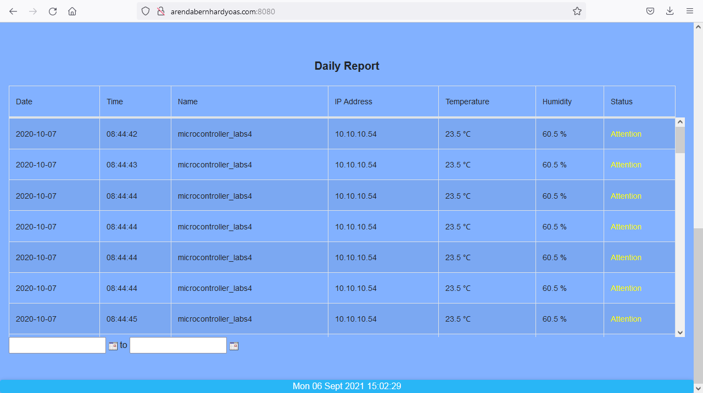
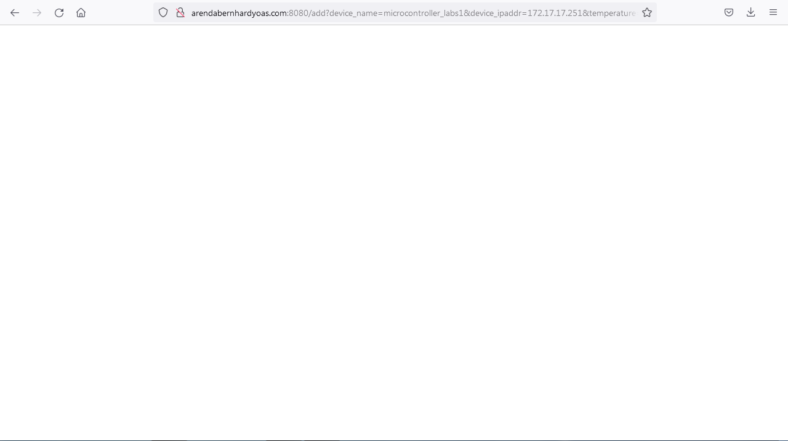
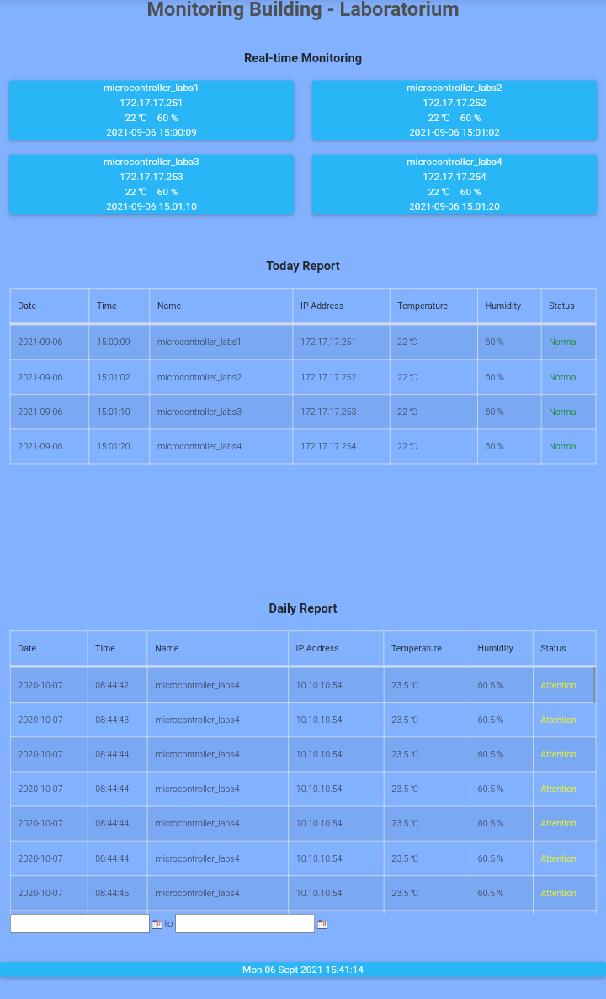

# Monitoring Laboratorium

## Build interface and data processing laboratorium temperature and humidity from field instrument.

### Descriptions

* Using NodeJS runtime stack version 14 LTS
* Using jQuery [here](https://jquery.com/download/)
* Using MDBootstrap 5 [here](https://mdbootstrap.com/docs/standard/getting-started/installation/)
* Using PostgreSQL

Field instrument can be microcontroller with temperature and humidity sensor. 
Laboratorium temperature and humidity from field instrument sending data with HTTP request GET method. 
String HTTP request GET: 
`http://[ip address or domain]:[port]/add?device_name=[device name]&device_ipaddr=[device ip address]&temperature=[temperature value]&humidity=[humidity value]` 

### Result
Main Page 

HTTP Request GET 

Mobile 

